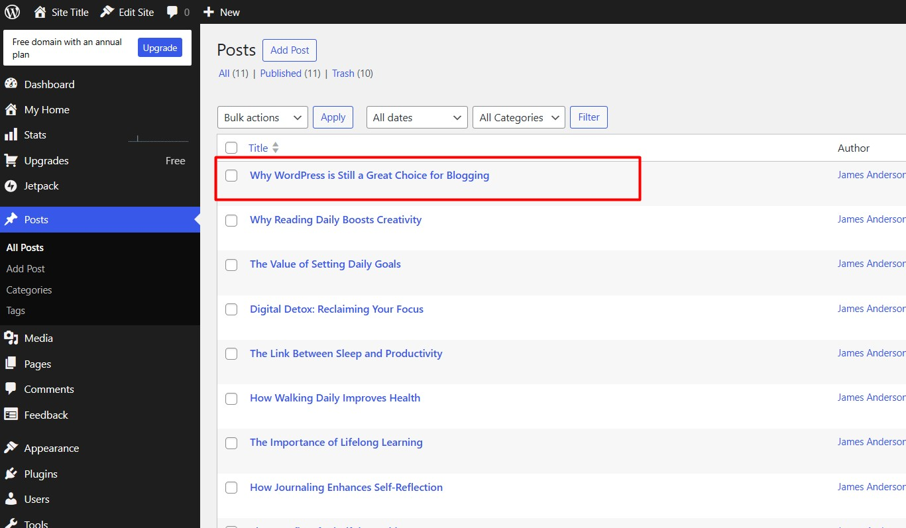
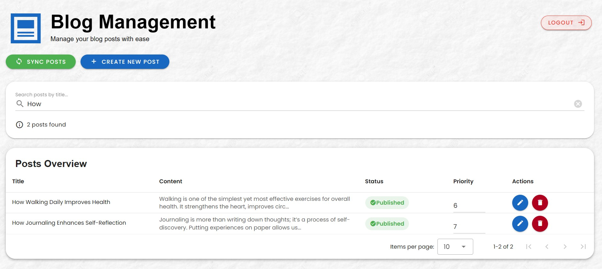

# Laravel WordPress Blog Application

|  |  |
|-------------|--------------|

This is a Laravel + Vue based WordPress Blog Management back office that allows admins to create, edit, delete, and manage blog posts. It supports WordPress integration for authentication.

---

## Features

- WordPress Admin login
- CRUD operations for blog posts
- Post priority management
- Draft & Publish status
- Search posts by title
- User-friendly Vuetify front-end
- Web & API laravel backoffice

---

## Requirements

- PHP >= 8.1
- Composer
- MySQL
- Node.js & npm (for front-end assets)
- Git

---

## Usage

### Clone the repository:

```bash
git clone https://github.com/ashain760/laravel-wordpress-blog.git
```

### Install PHP dependencies:

```
composer install
```

### Install front-end dependencies:

```
npm install
npm run build
```

### Copy .env.example to .env:

```
cp .env.example .env
```

### Generate application key

```
php artisan key:generate
```

### Set your environment variables in .env

```
DB_HOST=<your_database_host>
DB_PORT=3306
DB_DATABASE=<your_database_name>
DB_USERNAME=<your_database_user>
DB_PASSWORD=<your_database_password>
```

### Run MySql database migrations

```
php artisan migrate:fresh
```

### Running Locally

```
php artisan serve
```

1. Display login screen


2. After click "Sign in with WordPress" it redirects to WordPress login


##### Sample ADMIN WordPress account login details (wordpress.com):

Username:
```
jamesanderson755698
```
Password:
```
RvUCa1NP@LvtOfwqp0X0KgQ*
```

##### Sample ADMIN Gmail account login details:

Username:
```
james.anderson755698@gmail.com
```
Password:
```
james@123
```
3. After logged in, it redirects to user approval section. click "Approve"


4. After approval & login success it redirects to blog post page


5. In blog post page you can add edit delete sync search blogs

##### Create blogs


##### Update blogs





##### Add priority blogs


##### Delete blogs


##### Search blogs


